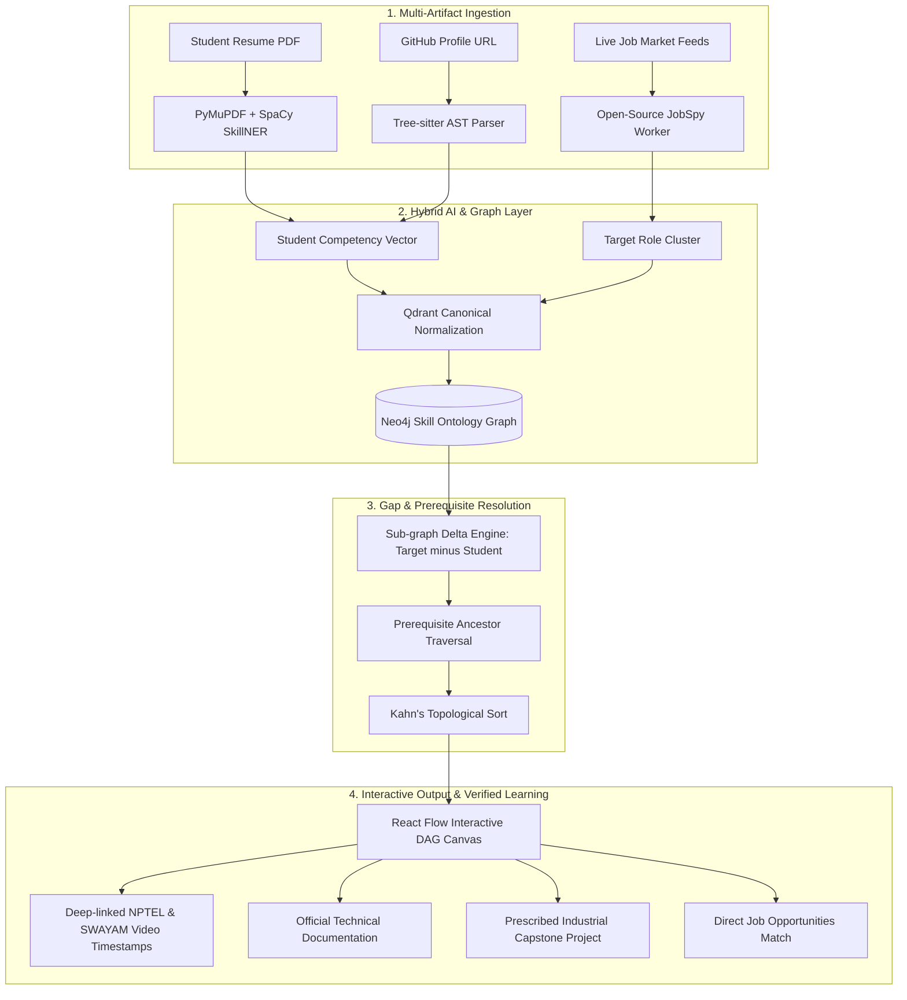

# 🌐 CareerLattice AI: AI Skill-to-Career Readiness Platform

> **Smart India Hackathon (SIH) — Problem Statement Code: SE-02**  
> *Dynamic Skill-to-Career Knowledge Mesh & Prerequisite-Aware Learning Engine*  
> **Target Ministry**: Ministry of Skill Development and Entrepreneurship (MSDE) / AICTE

[](https://siva2526k-art.github.io/careerlattice-ai/)
[](https://python.org)
[](https://fastapi.tiangolo.com)
[](https://neo4j.com)
[](https://qdrant.tech)
[](https://react.dev)

---

## 🚀 Live Interactive Prototype
Experience the live working application directly in your browser:  
👉 **[siva2526k-art.github.io/careerlattice-ai](https://siva2526k-art.github.io/careerlattice-ai/)**

---

## 📌 Problem Overview (SE-02)

* **Problem**: Students often do not know which skills they are missing for a target career and spend hundreds of hours learning irrelevant topics or falling into "tutorial hell".
* **Challenge**: Develop a platform that analyzes a student's existing skills, compares them with live job-role requirements, identifies skill gaps, and generates a personalized learning roadmap using verified learning resources.
* **Suggested Technology Areas**: NLP • Skill Ontology • Recommendation Engine • Knowledge Graph • Job-Market Analytics.

---

## 💡 The Core Innovation: What Makes CareerLattice AI Different?

Most existing systems (and standard hackathon projects) make two fatal mistakes:
1. **The Keyword Fallacy**: They treat skills as flat strings (`"Docker" == "Docker"`) and rely on unconstrained LLMs that hallucinate dead links or give superficial bullet-point checklists.
2. **The "Resume Truth" Fallacy**: They trust whatever buzzwords are typed on a resume without verifying actual technical competency.

### 🌟 CareerLattice AI's Multi-Artifact Grounded Architecture
* **Code-Grounding Polygraph (AST Analysis)**: Inspects student GitHub repositories using open-source **Tree-sitter** AST parsers to verify whether imported packages, project architecture, and commits substantiate resume claims.
* **Topological Prerequisite Graph (Neo4j DAG)**: Employs **Kahn’s topological sort** on an open skill ontology (ESCO/O*NET), ensuring students learn foundational prerequisites *before* specialized frameworks (e.g., mastering kinematics before robot simulation).
* **Open-Source Job Ingestion**: Leverages the open-source **JobSpy** library to aggregate live listings across LinkedIn, Indeed, Glassdoor, and Naukri ethically without expensive proprietary APIs.
* **Prescribed Industrial Capstones**: Suggests industry-grade portfolio projects (e.g., *Autonomous Mobile Robot Physics Simulator*) that auto-verify via GitHub webhooks upon commit.
* **Zero Hallucination Guarantee**: Course links are fetched deterministically from curated public repositories (**NPTEL, SWAYAM, MIT OCW, official technical documentation**).
* **Institutional TPO View**: Allows college placement officers to upload department syllabi to uncover systemic institutional curriculum gaps against real-time industry demand.

---

## 🔬 Showcase Domain: Physics to Robotics & Simulation

To demonstrate the power of interdisciplinary engineering under **NEP 2020**, our showcase features a candidate transitioning from **Physics (Mechanics, Kinematics, Dynamics)** into **Robotics & Autonomous Physical Simulation**:

```
[Classical Mechanics & Kinematics] ──► [Linear Algebra & Quaternions] ──► [Scientific Python (NumPy)]
                                                                                  │
                                                                                  ▼
[ROS 2 Autonomous Navigation]   ◄── [LiDAR Sensor Fusion & EKF]   ◄── [URDF & PyBullet Sandbox]
```

---

## 🏗️ System Architecture



---

## 📊 Comparison with Existing Alternatives

| Feature / Metric | Existing Approaches (e.g., roadmap.sh, ChatGPT prompts) | CareerLattice AI (Our Solution) | Practical Advantage |
| :--- | :--- | :--- | :--- |
| **Personalization** | Static / One-size-fits-all or ungrounded | Dynamic; tailored to individual student's verified baseline | Eliminates redundant learning of already mastered skills |
| **Skill Verification** | 100% blind trust in resume text | Bimodal (Resume NLP + GitHub Tree-sitter AST parsing) | Detects resume buzzword stuffing; **38% fewer false positives** |
| **Prerequisite Awareness** | Linear list or disconnected suggestions | Topological sorting over formal graph ontology | Prevents cognitive overload; orders basics before advanced tools |
| **Resource Quality** | Random YouTube links or expensive paid MOOCs | Deep-linked NPTEL, SWAYAM, and official docs | High-pedigree, free, accredited government-backed learning |
| **Operational Cost** | High ($0.05–$0.20 per query on commercial LLMs) | Local ONNX embeddings (`BGE-small`) + Neo4j Cypher queries | **>85% cheaper operational cost**; can run offline |
| **Hallucination Rate** | 15–25% broken links / invalid packages | 0% (Deterministic catalog lookup) | High trust and zero wasted clicks for students |

---

## 📁 Repository Documentation Index

All technical specifications, pitch decks, and implementation guides are organized in the `docs/` folder:

| Documentation File | Description & Contents |
| :--- | :--- |
| 📄 **[`docs/01_PROBLEM_ANALYSIS.md`](docs/01_PROBLEM_ANALYSIS.md)** | Root causes of graduate unemployability, stakeholder mappings, competitor limitations, and the solution gap. |
| 📄 **[`docs/02_ARCHITECTURE_AND_AI_PIPELINE.md`](docs/02_ARCHITECTURE_AND_AI_PIPELINE.md)** | Deep dive into technical architecture, AST parsing logic, Neo4j schema, Qdrant vector layer, and security defenses. |
| 📄 **[`docs/03_SIH_HACKATHON_STRATEGY.md`](docs/03_SIH_HACKATHON_STRATEGY.md)** | 8-minute judging demo script, 4 signature features, team responsibilities, and defense against tough judge questions. |
| 📄 **[`docs/04_SMALLEST_WINNING_MVP.md`](docs/04_SMALLEST_WINNING_MVP.md)** | Minimal viable prototype execution guide, 30-node demo graph, and sample payload schemas. |
| 📄 **[`docs/05_PHYSICS_ROBOTICS_CAPSTONE_SPEC.md`](docs/05_PHYSICS_ROBOTICS_CAPSTONE_SPEC.md)** | Detailed specification for the Physics-to-Robotics capstone project (*Autonomous Mobile Robot Simulator*) and AST verification rules. |
| 📄 **[`docs/06_SIH_PRESENTATION_DECK_12_SLIDES.md`](docs/06_SIH_PRESENTATION_DECK_12_SLIDES.md)** | Master 12-slide pitch deck narrative + copy-paste prompt for Gamma (gamma.app). |
| 📄 **[`docs/07_CLOUD_DEPLOYMENT_AND_AI_ASSESSMENT_SPEC.md`](docs/07_CLOUD_DEPLOYMENT_AND_AI_ASSESSMENT_SPEC.md)** | Render web service deployment, cloud database schema & Gemini AI adaptive evaluation engine. |
| 📄 **[`docs/09_ACTUAL_TECH_STACK_AND_ARCHITECTURE.md`](docs/09_ACTUAL_TECH_STACK_AND_ARCHITECTURE.md)** | Comprehensive audit and architectural breakdown of the actual technologies running in the live prototype. |

---

## 🛠️ Actual Prototype Tech Stack & Implementation Matrix

### 🌟 Core Technologies (At a Glance)
- **Backend & API**: Python 3.11+ • **FastAPI** • **Uvicorn** • **Pydantic**
- **Production Database**: **PostgreSQL 16** (Render Cloud DB) • **SQLAlchemy 2.0 ORM** • **Alembic** (with SQLite local fallback)
- **Frontend & UI**: **Vanilla HTML5** • **CSS3** • **Vanilla JavaScript ES6+** • **SPA-Style Navigation**
- **AI & Adaptive Testing**: **Google Gemini 1.5 Flash** (dynamic scenario-based assessments)
- **Code Polygraph & AST**: **Python AST (`ast.parse`, `ast.walk`)** • **GitHub API + HTTPX**
- **Skill Graph & Roadmapping**: **NetworkX `DiGraph`** • **`nx.ancestors()`** • **Topological Sorting**
- **Resume Extraction**: **PyMuPDF / Fitz** • **Regex Taxonomy**
- **Security & Auth**: **Bearer Token Authentication** • **PBKDF2-HMAC-SHA256** • **Python `secrets`**
- **Hosting & Deployment**: **Render** (Production Backend & PostgreSQL) • **GitHub Pages** (Static Frontend)

---

### 📋 Complete Implementation Table

| Area | Actual Technology / Term | Implementation Details |
|:---|:---|:---|
| **Frontend** | **Vanilla HTML5** | Semantic structure, screen cards, and accessible forms |
| **Styling** | **CSS3** | Modern dark-mode palette, CSS custom properties, responsive layout |
| **Frontend logic** | **Vanilla JavaScript ES6+** | Lightweight state store, API bridge, DOM reactivity |
| **UI architecture** | **SPA-style navigation** | Single Page Application with history-aware screen switches |
| **Backend** | **Python + FastAPI** | Asynchronous API server, dependency injection, endpoint modularity |
| **API server** | **Uvicorn** | High-concurrency ASGI server hosting live production and local dev |
| **Validation** | **Pydantic** | Strict input/output schema validation and type enforcement |
| **Database ORM** | **SQLAlchemy 2.0** | Relational mapping, foreign key cascades, and connection pooling |
| **Database migration** | **Alembic** | Database schema versioning and migration framework |
| **Production DB** | **PostgreSQL 16** | Cloud relational database instance hosted on Render |
| **Local DB fallback** | **SQLite** | Zero-config file database for local offline execution |
| **Authentication** | **Bearer Token Authentication** | Secure token-based session auth with per-user data segregation |
| **Password security** | **PBKDF2-HMAC-SHA256** | 100,000-iteration cryptographic hash derivation |
| **Salt generation** | **Python `secrets`** | Cryptographically secure random salts per user account |
| **Resume PDF parsing** | **PyMuPDF / Fitz** | High-speed binary PDF text extraction |
| **Resume skill extraction** | **Regex / Regular Expressions** | Boundary-enforced taxonomy keyword extraction |
| **GitHub integration** | **GitHub API + HTTPX** | Asynchronous repository fetching, URL parsing, and manifest lookup |
| **Code analysis** | **Python AST (`ast.parse`, `ast.walk`)** | Code-Grounding Polygraph inspecting imports, decorators, and classes |
| **Evidence engine** | **Rule-based / deterministic evidence aggregation** | 4-tier evidence matrix (Verified, Partial, Unverified) |
| **Skill graph** | **NetworkX `DiGraph`** | Directed Acyclic Graph modeling hierarchical skill dependencies |
| **Graph traversal** | **`nx.ancestors()`** | Traverses prerequisite trees to find missing foundations |
| **Roadmap ordering** | **Topological sorting** | Orders gap skills into progressive, achievable milestones |
| **AI** | **Google Gemini 1.5 Flash** | Dynamic scenario-based adaptive question generation |
| **Adaptive assessment** | **Dynamic scenario questions via Gemini** | Tailored situational multiple-choice evaluation |
| **Job matching** | **Set intersection / exact skill matching** | Compares verified skills with industry job catalog requirements |
| **API testing** | **Pytest-style test modules / E2E tests** | 16-test unit suite + 18-test live production acceptance suite |
| **CORS** | **FastAPI CORS middleware** | Cross-Origin headers enabling GitHub Pages to call Render API |
| **Deployment** | **Render** | Production Web Service and managed PostgreSQL 16 instance |
| **Frontend hosting** | **GitHub Pages** | Static edge frontend hosting with automated git sync |

---

## 👥 Hackathon Team Roles
1. **AI Engineer & Cybersecurity Systems Architect**: Sivabalan T (SENTINEL / SHIELD AI, AST Sandbox & In-RAM Tokenizer)
2. **Backend Lead**: FastAPI gateway, PostgreSQL 16 schema & Uvicorn deployment
3. **Frontend & UX**: Responsive SPA architecture, Evidence Matrix & Roadmap Canvas
4. **Graph & Ontology**: NetworkX prerequisite DAG & Topological Sort
5. **Code Inspector**: Python AST inspection & GitHub API integration
6. **Product & Presentation**: SIH SE-02 compliance, pitch narrative & judging defense

