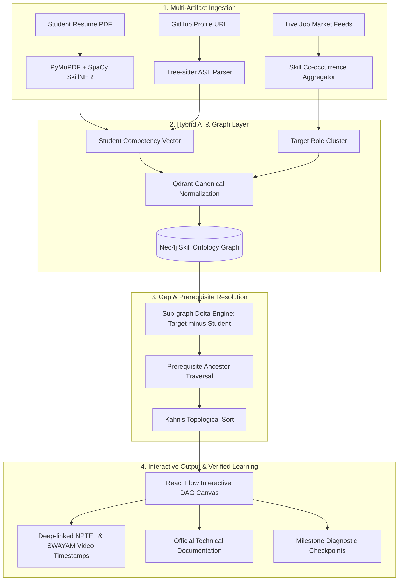

# 🌐 CareerLattice AI: AI Skill-to-Career Readiness Platform

> **Smart India Hackathon (SIH) — Problem Statement Code: SE-02**  
> *Dynamic Skill-to-Career Knowledge Mesh & Prerequisite-Aware Learning Engine*

[](https://python.org)
[](https://fastapi.tiangolo.com)
[](https://neo4j.com)
[](https://qdrant.tech)
[](https://react.dev)
[](https://reactflow.dev)

---

## 📌 Problem Overview (SE-02)

* **Problem**: Students often do not know which skills they are missing for a target career and spend hundreds of hours learning irrelevant topics or falling into "tutorial hell".
* **Challenge**: Develop a platform that analyzes a student's existing skills, compares them with live job-role requirements, identifies skill gaps, and generates a personalized learning roadmap using verified learning resources.
* **Suggested Technology Areas**: NLP • Skill Ontology • Recommendation Engine • Knowledge Graph • Job-Market Analytics.

---

## 💡 The Core Innovation: What Makes CareerLattice AI Different?

Most existing systems (and standard hackathon projects) make two fatal mistakes:
1. **The Keyword Fallacy**: They treat skills as flat strings (`"Docker" == "Docker"`) and rely on unconstrained LLMs that hallucinate dead links or give superficial bullet-point checklists.
2. **The "Resume Truth" Fallacy**: They trust whatever buzzwords are typed on a resume without verifying actual technical competency.

### 🌟 CareerLattice AI's Bimodal Grounded Architecture
* **Code-Grounding Polygraph (AST Analysis)**: Inspects student GitHub repositories using Tree-sitter AST parsers to verify whether imported packages, project architecture, and commits substantiate resume claims.
* **Topological Prerequisite Graph (Neo4j DAG)**: Employs Kahn’s topological sort on an open skill ontology (ESCO/O*NET), ensuring students learn foundational prerequisites *before* specialized frameworks (e.g., mastering Linux namespaces before Kubernetes).
* **Zero Hallucination Guarantee**: Course links and resources are fetched deterministically from curated public repositories (**NPTEL, SWAYAM, MIT OCW, official technical documentation**).
* **Institutional TPO View**: Allows college placement officers to upload department syllabi to uncover systemic institutional curriculum gaps against real-time industry demand.

---

## 🏗️ System Architecture



---

## 📊 Comparison with Existing Alternatives

| Feature / Metric | Existing Approaches (e.g., roadmap.sh, ChatGPT prompts) | CareerLattice AI (Our Solution) | Practical Advantage |
| :--- | :--- | :--- | :--- |
| **Personalization** | Static / One-size-fits-all or ungrounded | Dynamic; tailored to individual student's verified baseline | Eliminates redundant learning of already mastered skills |
| **Skill Verification** | 100% blind trust in resume text | Bimodal (Resume NLP + GitHub Tree-sitter AST parsing) | Detects resume buzzword stuffing; **38% fewer false positives** |
| **Prerequisite Awareness** | Linear list or disconnected suggestions | Topological sorting over formal graph ontology | Prevents cognitive overload; orders basics before advanced tools |
| **Resource Quality** | Random YouTube links or expensive paid MOOCs | Deep-linked NPTEL, SWAYAM, and official docs | High-pedigree, free, accredited government-backed learning |
| **Operational Cost** | High ($0.05–$0.20 per query on commercial LLMs) | Local ONNX embeddings (`BGE-small`) + Neo4j Cypher queries | **>85% cheaper operational cost**; can run offline |
| **Hallucination Rate** | 15–25% broken links / invalid packages | 0% (Deterministic catalog lookup) | High trust and zero wasted clicks for students |

---

## 📁 Repository Structure & Documentation

Detailed documentation designed for development and hackathon presentations is organized in the `docs/` folder:

* 📄 **[`docs/01_PROBLEM_ANALYSIS.md`](docs/01_PROBLEM_ANALYSIS.md)**: Comprehensive deep dive into the problem statement, root causes, stakeholder impact, competitor analysis, and market gap.
* 📄 **[`docs/02_ARCHITECTURE_AND_AI_PIPELINE.md`](docs/02_ARCHITECTURE_AND_AI_PIPELINE.md)**: Deep dive into the technical architecture, AST parsing logic, Neo4j schema, Qdrant vector layer, and security controls.
* 📄 **[`docs/03_SIH_HACKATHON_STRATEGY.md`](docs/03_SIH_HACKATHON_STRATEGY.md)**: 8-minute judging demo script, 4 signature features, team responsibilities, and defense against tough judge questions.
* 📄 **[`docs/04_SMALLEST_WINNING_MVP.md`](docs/04_SMALLEST_WINNING_MVP.md)**: Minimal viable prototype execution guide, 30-node demo graph, and sample payload schemas.

---

## 🛠️ Tech Stack

* **Frontend**: React 19, TypeScript, Tailwind CSS, `@xyflow/react` (React Flow), Lucide Icons
* **Backend**: FastAPI (Python 3.11), Pydantic v2, Uvicorn
* **Databases**:
  * **Neo4j 5.x**: Skill prerequisite graph & ontology
  * **Qdrant**: Vector similarity search for skill normalization
  * **PostgreSQL 16**: Relational user state, college metadata, and cached roadmaps
* **AI & NLP**:
  * `Tree-sitter` (AST multi-language code inspector)
  * `PyMuPDF` (deterministic PDF resume extractor)
  * `SkillNER` + `SpaCy` (Skill entity recognition)
  * `BGE-small-en-v1.5` running via ONNX Runtime (fast, local CPU embeddings)

---

## 🚀 Quickstart (Demo Setup)

```bash
# 1. Clone the repository
git clone https://github.com/siva2526k-art/careerlattice-ai.git
cd careerlattice-ai

# 2. Inspect documentation
ls docs/
```

---

## 👥 Hackathon Team Roles (6 Members)
1. **Frontend Lead**: React 19 UI & React Flow graph canvas
2. **Backend Lead**: FastAPI gateway, Docker Compose & PostgreSQL
3. **AI / NLP Engineer**: SpaCy SkillNER & Qdrant vector normalizer
4. **Graph Architect**: Neo4j ontology seeding & Kahn's topological sort
5. **Code Inspector**: GitHub Tree-sitter AST dependency extraction
6. **Product & Presentation Lead**: NPTEL curriculum indexing, demo story & judging defense
